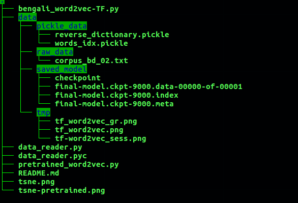
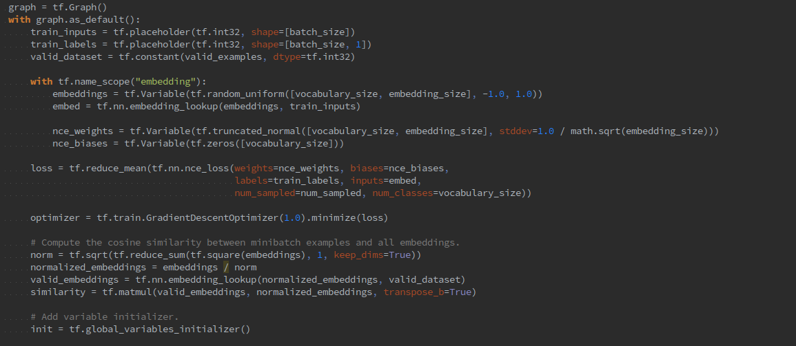
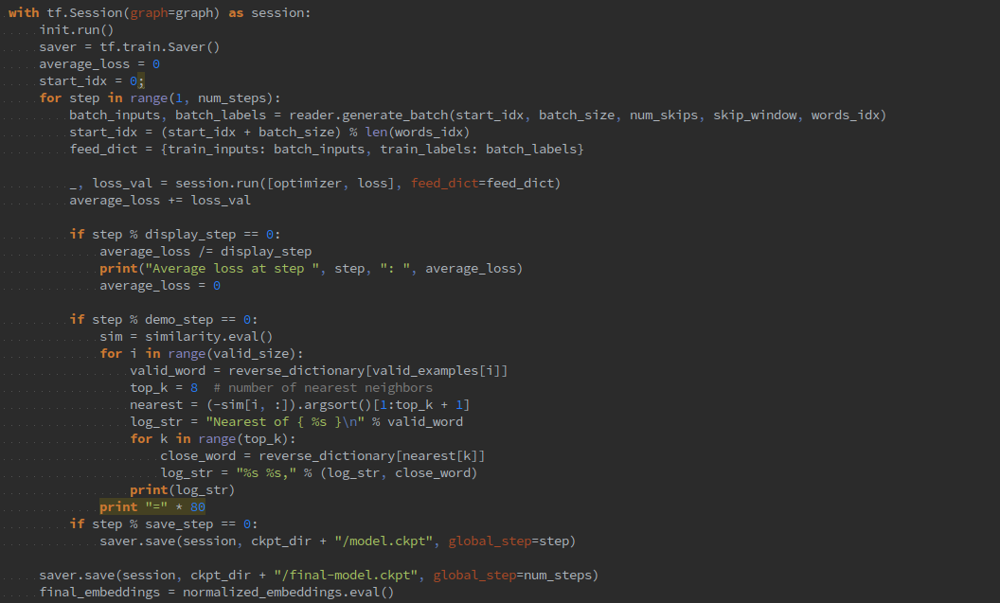

# Skip-Gram-Word-Embedding-TF
Tensorflow implementation of skip gram word embedding model for Bengali Language and can be ported on other tensorflow model

## Folder Structure

## TF-Graph

## TF-Session

## RUN
Define Path of raw txt file of large number of sentences ( change in line 131 at bengali_word2vec-TF.py file)
run: python bengali_word2vec-TF.py
Model saved on data/saved_model folder

To restore Model and and use for further works just change in line 85 at pretrained_word2vec.py

